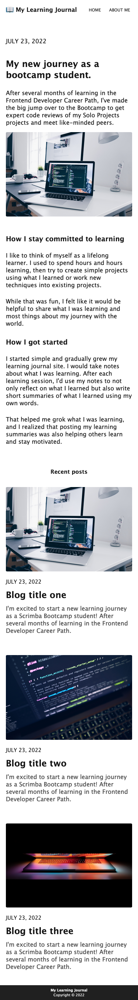

# learning-journal

A learning journal (or blog) created as part of the solo project for Module 6 (Responsive Design) of Scrimba's [Front-End Developer Career Path](https://scrimba.com/learn/frontend).

## Contents 

- [Overview](#overview)
- [My Process](#my-process)
  - [Built with](#built-with)
- [Screenshots](#screenshots)
  - [Desktop](#desktop)
  - [Mobile](#mobile)
- [Status](#status)
- [Connect](#connect)

## Overview

This is my solo project from [Module 6 of Scrimba's Front-End Career Path](https://scrimba.com/learn/frontend). The requirements of the project include:
- Follow the design specfications (as indicated in [the provided Figma file](https://www.figma.com/file/lXVKwGtzfhsR9tZd4RrPuH/Learning-Journal%2FBlog-(Copy)?node-id=0%3A1&t=OaCys8BegpkpPr5i-1))
- Build each page from "scratch"
- Make all pages responsive (i.e., relative unites, mobile-first design, media queries, etc.)

## My Process

Taking a mobile-first approach I started with designing the mobile versions of this website. This approach takes advantage of the built-in responsiveness of HTML and a few lines of CSS to create mobile-friendly websites. I've previously outlined in this approach in detailed in previous projects. If you'd like to read the full description, you can find it in the [process section for my 'Visit Chiang Mai' project](https://github.com/ananfito/visitchiangmai#my-process) and in these two blog posts: [I’ve Been Designing Websites All Wrong](https://ananfito.hashnode.dev/ive-been-designing-websites-all-wrong) and [Responsive Web Design with 3 Lines of CSS](https://ananfito.hashnode.dev/responsive-web-design-with-3-lines-of-css).

Once the mobile versions of the site were set, I moved on to designing the desktop versions. With the mobile-first approach this equates to adding a few lines of CSS within a media query to adjust the properties for fonts, margins, and padding to make it more desktop-friendly. 

The last part of my process is to work with the JavaScript. In this project, I used JavaScript to render the grid of blogposts and to make use of the 'View more' button on the home page. The data for the blog posts is stored with an array of objects. I made used of the following methods to grab the data and manipulate it for rendering: 
- `.forEach()`
- `.slice()`

### Built with

- HTML
- CSS
- JavaScript

## Screenshots

### Desktop

### Mobile

## Status

A live version can be viewed at: .

## Connect

Thank you for reading about this project. If you'd like to connect with me for mentoring, collaboration, or employment opportunities, you can do so via the following links:

- [Email](https://anthonynanfito.com/contact/)
- [LinkedIn](https://linkedin.com/in/anthonynanfito)
- [Portfolio](https://ananfito.github.io)
- [Blog](https://ananfito.hashnode.dev)
